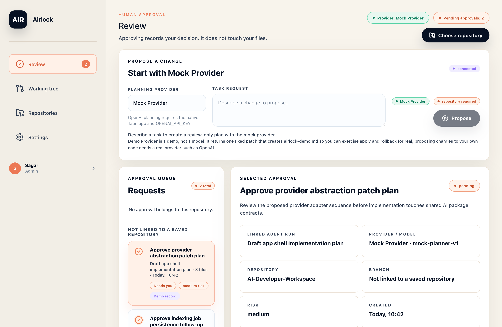
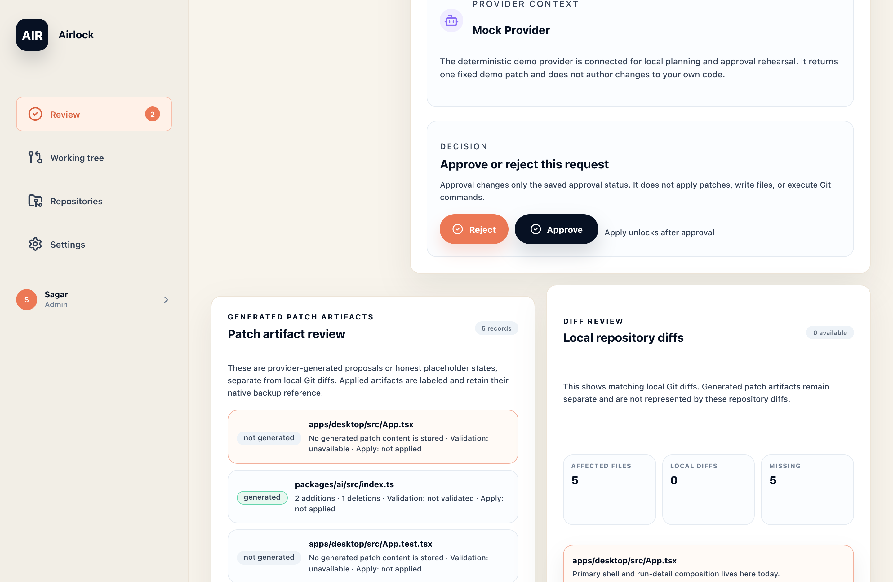
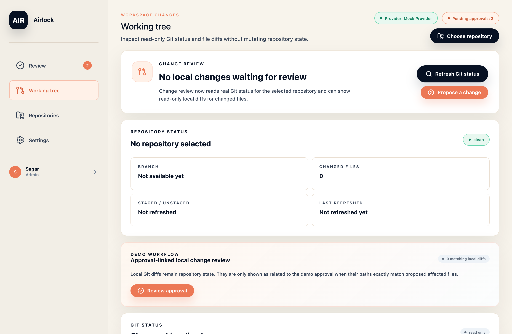
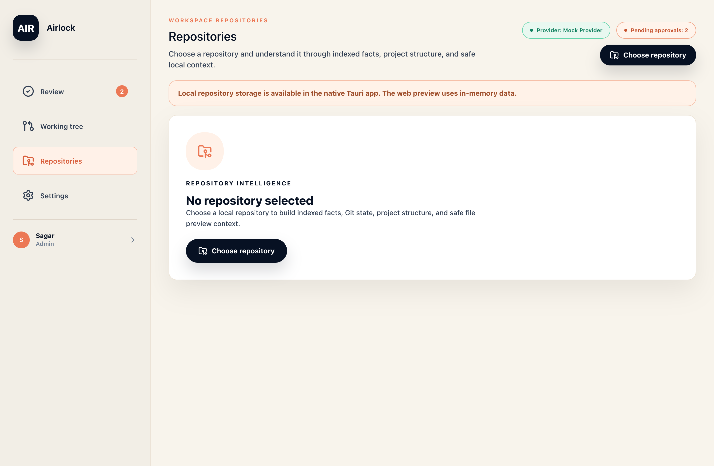
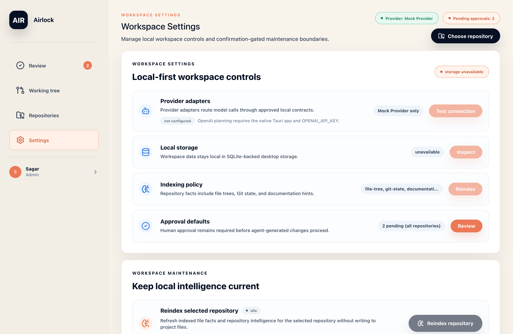

<h1 align="center">Airlock</h1>

<p align="center">
  <strong>A change-control airlock for AI-generated code.</strong><br>
  Nothing reaches your working tree unless a human approved it — and the machine can prove exactly what it did.
</p>

<p align="center">
  
</p>

---

## What is Airlock?

Airlock is a local-first desktop app for working with AI on a real repository **without letting the model touch your files**. A provider proposes a change; Airlock turns that proposal into a reviewable record — a plan, read-only checks, and a diff — and holds it behind an explicit human decision. Only after you approve, and only through a separate typed confirmation, does a single verified patch reach the working tree.

The guarantee it is built to hold:

> A diff you see is **proposed, not yet real**. Approving records your decision — it does not write a file. Applying is a distinct, gated, native action that backs up first and verifies exactly what changed.

Everything runs on your machine. Repository data stays in local SQLite; the native layer is authoritative for every write; the UI only ever passes durable IDs.

## How it works

Airlock has four surfaces. **Review** is the front door.

| Step | Where | What happens |
| --- | --- | --- |
| **1. Propose** | Review | Describe a change. A provider returns a structured plan and a patch artifact — never a file write. |
| **2. Check** | Review | Structure validation and a read-only `git apply --check` run automatically. The verdict reads *“applies cleanly”* or names the first blocking gate. |
| **3. Decide** | Review | Approve or reject. Approval records a decision; it never applies anything. |
| **4. Apply** | Review → Working tree | After approval, a typed-confirmation apply writes one artifact, behind a pre-apply backup and exact post-apply verification. Rollback restores from the app-local backup. |

The demo works **without an API key**: the built-in Mock Provider returns one real, applyable patch (it creates `airlock-demo.md`), so you can exercise the full propose → approve → apply → rollback loop offline.

## Screens

<table>
  <tr>
    <td width="50%"><br><sub><b>Review — checks, decision &amp; artifacts.</b> Gates run read-only; the 18 readiness checks sit behind an “Evidence” disclosure, not in your face.</sub></td>
    <td width="50%"><br><sub><b>Working tree.</b> Read-only Git status and local diffs. Airlock never stages, commits, or resets on your behalf.</sub></td>
  </tr>
  <tr>
    <td width="50%"><br><sub><b>Repositories.</b> Choose a local repo and understand it through indexed facts and safe, read-only context.</sub></td>
    <td width="50%"><br><sub><b>Settings.</b> Local-first controls. Destructive actions are confirmation-gated or simply not drawn until they can run.</sub></td>
  </tr>
</table>

## Getting started

### See it in the browser (fastest)

A UI preview runs in any browser with in-memory demo data — no repo, no Rust, no API key.

```bash
npm install
npm run dev:web -w @ai-dev/desktop
# open http://127.0.0.1:1420
```

> The browser preview cannot open local folders or run the native safety commands — it is for exploring the UI and the demo flow. Use the desktop app for real repositories.

### Run the desktop app (full experience)

The native Tauri app adds local folder selection, SQLite persistence, real Git inspection, and the safe apply/rollback commands.

```bash
npm install
npm run dev        # launches the Tauri desktop app
```

**Prerequisites:** macOS (current packaged target), Node.js 20+, and Rust with Cargo (Tauri v2 prerequisites). Desktop scripts add Homebrew rustup at `/opt/homebrew/opt/rustup/bin` to `PATH`.

### Use OpenAI (optional)

Mock Provider is the default and needs no credentials. To let OpenAI generate plans and review-only patch artifacts, pass a key to the **native** process only:

```bash
OPENAI_API_KEY="..." npm run dev:tauri   # OPENAI_MODEL optionally selects a model
```

Credentials are read from the process environment and are never stored in React state, SQLite, `localStorage`, logs, or committed files. OpenAI generates proposals only — it does not apply patches or mutate Git.

## The safety boundary

Airlock’s value is what it *won’t* do. The native layer is authoritative for every write; the React app passes durable IDs only.

- **Approval is not application.** Agent runs, approval, validation, and dry-run never write repository files.
- **Apply is gated and explicit.** `Apply Patch` appears only after every gate passes and requires the exact phrase `APPLY PATCH`. Native code reloads the persisted patch and runs a fixed `git apply --whitespace=nowarn -` over stdin.
- **Back up, then verify.** A bounded backup is persisted before the write; application finalizes as `applied_verified` only when proposal, artifact, parsed diff, backup, fingerprint, and post-apply Git paths all match exactly. Anything unexpected is **quarantined** with Apply disabled.
- **Fail closed.** Dry-run and apply children are killed after 15s; an in-flight timeout becomes an *interrupted* attempt requiring manual inspection, never a silent retry. Interrupted state is reconciled conservatively on startup.
- **Rollback is app-local.** Restoring reverts to the pre-apply backup — it never invokes Git.
- **No Git surface for mutation.** No add, commit, reset, checkout, clean, or staging operation is exposed. Generated patch artifacts and local Git diffs are always shown as separate data.

See [Safe Patch Application Design](docs/security/patch-application-safety.md) for the implemented boundary, and the [disposable repository apply QA](docs/qa/disposable-repository-apply-qa.md) for how candidate builds are verified.

## Project layout

```text
apps/desktop/       React + Vite + Tauri shell, native commands, and persistence
packages/ai/        Provider, agent-run, proposal, artifact, and approval types
packages/core/      Shared workspace and Git contracts
packages/indexing/  Repository indexing and intelligence helpers
packages/ui/        Shared UI primitives and icons
docs/               Product, architecture, safety, engineering, and demo docs
```

## Verification

```bash
npm run typecheck
npm run lint
npm run test
npm run build
git diff --check
```

Rust-specific checks:

```bash
PATH=/opt/homebrew/opt/rustup/bin:$PATH cargo fmt \
  --manifest-path apps/desktop/src-tauri/Cargo.toml -- --check
PATH=/opt/homebrew/opt/rustup/bin:$PATH cargo test \
  --manifest-path apps/desktop/src-tauri/Cargo.toml
```

The desktop build emits macOS artifacts under `apps/desktop/src-tauri/target/release/bundle/`.

## Docs

- [Current MVP scope](docs/mvp-scope.md)
- [Recorded demo script](docs/demo-script.md)
- [Roadmap &amp; findings](docs/roadmap.md)
- [Project state](PROJECT-STATE.md) · [Changelog](CHANGELOG.md)

## Known limitations

- Safe apply is limited to **one eligible single-file text artifact** per action; multi-artifact transactions are not implemented, and quarantined outcomes require manual inspection.
- Approval alone never applies an artifact — native revalidation and exact typed confirmation remain mandatory.
- OpenAI requires native runtime configuration and network access.
- Native packaging is currently verified for macOS ARM64.
- Team collaboration, remote repositories, and production-grade credential storage are outside this checkpoint.
