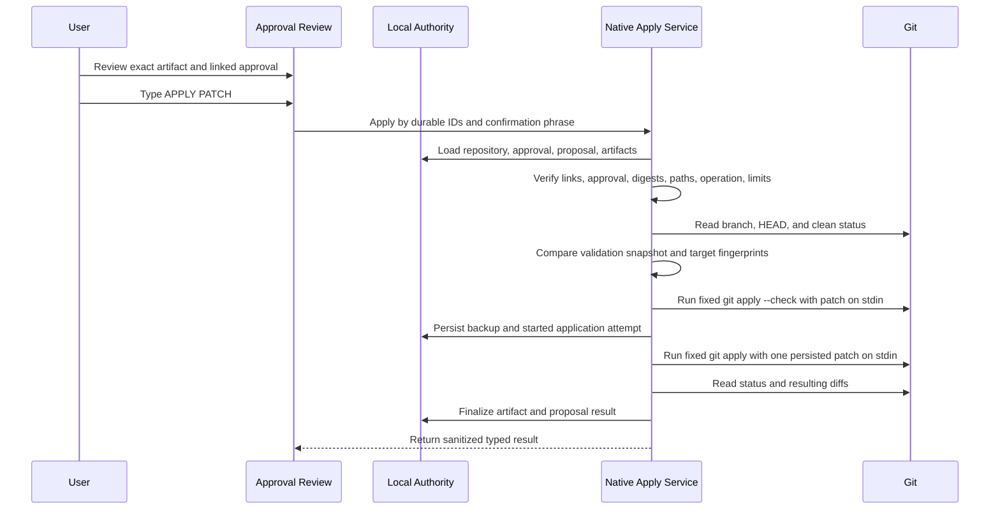

# Safe Patch Application Design

## Status

- Status: Safe Patch Application v1 implemented
- Scope: Native application of one approved, generated, single-file patch
  artifact
- Implementation status: Enabled only after every native safety gate and exact
  typed confirmation pass
- Recovery status: Pre-apply backups, conservative interrupted-attempt
  reconciliation, repository-scoped cross-process locking, and bounded Git
  child-process timeouts implemented; automated rollback remains future work
- Release classification: Local MVP capability with a documented disposable
  packaged-app QA protocol; execution evidence is still required per build
- Last updated: 2026-07-15

This document defines the implemented Safe Patch Application v1 boundary and
the remaining hardening work. The application may modify one working-tree file
only through the dedicated native command described here. It still cannot
stage, commit, reset, checkout, clean, or run arbitrary commands.

For the release checkpoint and recorded-demo boundary, see
[`docs/mvp-scope.md`](../mvp-scope.md) and
[`docs/release-notes/mvp-demo-v1.md`](../release-notes/mvp-demo-v1.md).

## Decision Summary

The first patch application capability must follow these decisions:

1. The linked proposed-change approval must be approved, but approval alone
   never applies a patch. Application additionally requires current artifact
   and repository evidence plus exact typed confirmation.
2. React may request application by durable IDs only. It must not choose an
   arbitrary repository path, file path, Git command, argument list, or patch
   body at apply time.
3. The native application service must load authoritative repository,
   proposal, artifact, validation, and approval records before every apply.
4. The native boundary must repeat all path and structure checks and run a
   fresh `git apply --check` immediately before application.
5. Version 1 requires a clean Git working tree and a named, unchanged branch.
6. Version 1 applies one single-file UTF-8 unified diff at a time. Rename,
   binary, symlink, submodule, executable-mode, and metadata-only patches remain
   unavailable.
7. React sends repository, proposal, approval, and artifact IDs plus the exact
   phrase `APPLY PATCH`; it never sends patch content.
8. Application changes working-tree files only. It must not stage, commit,
   reset, checkout, clean, stash, switch branches, or contact a remote.
9. An artifact in `applying` or `applied` state cannot be replayed. A failed
   attempt requires refreshed validation before retry.
10. The system must persist an application attempt before the native write and
    verify repository state afterward. It must never hide an uncertain or
    partially observed outcome.

## Current Safety Boundary

The current product can:

- Persist generated patch artifacts as review-only data.
- Validate repository-relative paths and single-file unified diff structure.
- Reject unsafe, mismatched, binary, oversized, and unsupported artifacts.
- Run read-only `git apply --check --whitespace=nowarn -` inside the selected
  repository.
- Persist validation results, normalized SHA-256 artifact digests, and a
  repository snapshot containing branch, short HEAD, clean state, changed-file
  count, relevant paths, bounded target-file fingerprints, and capture time.
- Recompute artifact digests when retained patch content changes and compare
  validation evidence with a fresh read-only native snapshot digest.
- Record approval or rejection without applying a patch.
- Read real local Git status and diffs separately from generated artifacts.
- Derive apply-readiness gates in Agent Runs and Approval Review.
- Enable `Apply Patch` only when every frontend eligibility signal passes.
- Reload durable records and repeat every authoritative check in the native
  command.
- Persist a bounded pre-apply backup and application-attempt record before the
  write.
- Hold an app-local repository-scoped advisory lock with a durable SQLite lock
  audit record for the complete authoritative apply request.
- Terminate fixed `git apply --check` and `git apply` child processes after 15
  seconds without retrying.
- Apply one persisted patch through fixed `git apply --whitespace=nowarn -`.
- Persist applied/failed state and refreshed Git status after the attempt.

The current product cannot:

- Stage or commit changes.
- Apply from browser preview or accept raw patch text from React.
- Apply more than one artifact in one action.
- Automatically roll back a backup.

Approval and `dry_run_passed` remain review evidence, not independent write
permission. Exact confirmation and the native command are always required.

### Informational Readiness Gates

The current UI evaluates only data already available to the review surfaces:

- Linked approval status.
- Generated artifact state.
- Structure and dry-run validation status.
- Selected repository and proposal repository match.
- Latest known clean, dirty, or unknown working-tree state.
- Informational relative-path and protected-path checks.
- Binary and size-limit state.
- Current artifact digest compared with the digest bound to validation.
- Native validation snapshot availability.
- Target-file fingerprint availability and policy status.
- Current authoritative snapshot digest compared with the validation snapshot
  digest.

Readiness results are `ready to apply`, `applied`, `blocked`, or `checks
pending`. They do not grant authority; the native command independently reloads
and verifies durable records. A digest or repository snapshot mismatch blocks
application with a revalidation instruction. Missing native evidence is
labeled `Unavailable`; validation that has not run is `Not checked yet`. The
native snapshot digest binds repository identity,
branch, HEAD, Git state, relevant paths, artifact digest, and sorted target-file
fingerprints. Capture timestamps are stored but intentionally excluded from the
comparison digest. All readiness checks are repeated by the native apply
authority rather than trusted as frontend security decisions.

### Current Target Fingerprint Boundary

- Only safe repository-relative paths supplied by the persisted proposal are
  accepted.
- Existing regular UTF-8 files up to 256 KiB receive a SHA-256 content hash,
  byte size, and modified timestamp.
- A snapshot accepts at most 64 persisted proposal paths, each no longer than
  320 characters.
- Missing files receive a typed `missing` fingerprint without a content read.
- Binary, oversized, symlink, unreadable, forbidden, and outside-root targets
  receive typed non-hashable states.
- `.git` paths, `.env` files, private-key names/extensions, credential files,
  and secret-like files are never content-read or hashed.
- File bytes never cross the native boundary. React receives metadata and
  digests only.

## Goals

- Apply only the exact generated content that a human reviewed and authorized.
- Keep every write bounded to the selected, saved repository root.
- Prevent stale approvals from applying against changed repository state.
- Preserve pre-existing user work.
- Make the action explicit, understandable, attributable, and auditable.
- Fail closed on malformed state, runtime uncertainty, or unsupported patches.
- Leave the resulting working-tree changes unstaged and available for review.
- Provide deterministic recovery guidance without destructive automation.

## Non-Goals

Version 1 will not:

- Apply a patch from web preview.
- Accept a manually entered repository path or raw patch body.
- Apply to a dirty working tree.
- Resolve conflicts or fuzz failed hunks.
- Apply only part of an approved proposal.
- Apply binary, rename, delete, symlink, submodule, or file-mode changes.
- Stage, unstage, commit, reset, checkout, clean, stash, push, or open a pull
  request.
- Automatically roll back with Git or overwrite files after an uncertain
  failure.
- Reuse an approval indefinitely or across regenerated artifacts.
- Let a provider invoke the apply operation directly.

## Security Invariants

The implementation must preserve all of these invariants:

### Repository Boundary

- A repository must already be selected and saved through the native picker.
- The repository ID on the proposal, approval, application request, and active
  repository must match.
- Native code must resolve the repository root from authoritative saved state.
- Native code must canonicalize the repository root before validation.
- No caller-provided absolute repository path may select the write target.

### Artifact Boundary

- Every patch artifact must belong to the approved proposed change.
- Every artifact must be in `generated` state and contain retained text diff
  content.
- The selected artifact digest must match the digest bound to its successful
  native validation evidence.
- Regenerating, editing, or replacing the selected artifact invalidates its
  validation evidence and blocks application.

### Approval Boundary

- The linked proposed-change approval must be `approved` before application is
  available.
- Approval alone does not authorize a write; all native evidence and typed
  confirmation gates remain mandatory.
- An artifact already in `applying` or `applied` state must fail before any
  write.
- Providers and agent runtimes cannot approve their own output.

### Repository-State Boundary

- The repository must be Git-backed for version 1.
- The working tree and index must be clean immediately before application.
- The branch must be named and must match the approved branch.
- `HEAD`, Git status digest, and target-file fingerprints must match the
  approved snapshot.
- A fresh native structure validation and dry-run must pass after these checks.

### Command Boundary

- Native code must invoke a fixed executable and fixed arguments without a
  shell.
- Patch content may be supplied only over stdin.
- No arbitrary Git command or argument passthrough may exist.
- Application must not use `--index`, `--cached`, `--reject`, or options that
  stage changes, permit partial application, or write outside the working tree.
- Raw Git stderr and patch content must not be returned to telemetry or logs.

## Threat Model

The design must address:

- A provider returning traversal, absolute, multi-file, binary, or mismatched
  patch paths.
- A compromised or buggy frontend changing IDs, paths, patch content, or
  approval state immediately before apply.
- A stale approval being replayed after the branch, `HEAD`, files, proposal, or
  artifact content changed.
- Symlinks or nested repositories redirecting a path outside the selected
  repository.
- A dirty working tree causing generated changes to overwrite or merge with
  user-authored work.
- Multiple windows or processes attempting to apply the same approval.
- Process termination during the native write or before result persistence.
- A failed command producing unexpected partial working-tree changes.
- Sensitive patch content leaking through diagnostics, logs, analytics, or
  crash reports.
- A successful application being mistaken for staging, commit, deployment, or
  completion of the engineering task.

## Terminology

- **Plan approval**: permission to use a proposed plan as review context.
- **Change acceptance**: a human review decision on a proposed change.
- **Application approval**: one-shot permission to apply exact artifact bytes
  to an exact repository snapshot.
- **Artifact digest**: SHA-256 of the normalized retained artifact bytes plus
  the normalized file path and declared operation.
- **Repository snapshot**: the branch, `HEAD`, Git status digest, and target
  fingerprints used for validation and approval.
- **Application attempt**: durable record created before native application and
  finalized only after post-apply verification.

## Version 1 Eligibility Policy

Every condition is required. Missing or unknown values are ineligible.

| Area            | Required state                                                  | Failure result            |
| --------------- | --------------------------------------------------------------- | ------------------------- |
| Runtime         | Native Tauri runtime                                            | `native_runtime_required` |
| Repository      | Saved, selected, canonical, Git-backed root                     | `repository_unavailable`  |
| Repository link | Proposal and approval repository IDs match active repository    | `repository_mismatch`     |
| Branch          | Named branch matching approved snapshot                         | `branch_changed`          |
| HEAD            | Current commit matches approved snapshot                        | `head_changed`            |
| Git state       | Index and working tree are clean                                | `working_tree_not_clean`  |
| Proposal        | Persisted and `approved`; not rejected, superseded, or applied  | `proposal_not_approved`   |
| Artifact        | Selected artifact is generated text with retained content       | `artifact_not_generated`  |
| Validation      | Structure valid and fresh dry-run passes                        | `validation_required`     |
| Confirmation    | Exact phrase `APPLY PATCH`                                      | `confirmation_required`   |
| Operation       | Create or modify regular UTF-8 text file                        | `operation_unsupported`   |
| Limits          | Existing per-artifact and future proposal aggregate limits pass | `patch_limit_exceeded`    |

The first implementation should use the existing 64 KiB and 4,000-line limits
for each artifact. Before implementation, an aggregate proposal file-count,
byte, and line limit must be selected, documented, and tested. Unknown or
unbounded aggregate size must fail closed.

## Unsupported Paths And File Types

Version 1 must reject:

- Absolute or empty paths.
- `.` or `..` path components.
- Null bytes, control characters, platform prefixes, or alternate separators
  that bypass normalized relative-path checks.
- `.git` and every descendant of `.git`.
- Paths traversing a symlink, nested repository, or submodule boundary.
- Targets whose nearest existing parent canonicalizes outside the repository.
- Existing symlinks, sockets, devices, FIFOs, or non-regular files.
- Environment and secret-bearing paths covered by the provider/context secret
  policy, including `.env` variants and recognized private-key files.
- Diff metadata that changes file mode, creates a symlink, changes submodule
  pointers, or encodes rename/copy behavior.

For create operations, native code must validate every existing parent path and
must reject any symlink component. It must not create missing parent
directories in version 1.

## Approval And Confirmation Boundary

Safe Patch Application v1 requires the durable approval already linked to the
proposed change to be `approved`. That decision alone has no write side effect.
The selected artifact must separately pass current validation, dry-run, digest,
snapshot, fingerprint, path, size, text, repository, and clean-tree checks.

The user must then type `APPLY PATCH` in the apply surface. The native command
checks that phrase again and rejects artifacts already marked `applying` or
`applied`. A separately versioned, expiring, one-shot application-approval
record remains a future defense-in-depth improvement.

## Repository Snapshot

The approved snapshot should contain:

```ts
type RepositoryApplicationSnapshot = {
  repositoryId: string;
  canonicalRootDigest: string;
  branch: string;
  headOid: string;
  gitStatusDigest: string;
  targetFingerprints: Array<{
    path: string;
    exists: boolean;
    contentSha256?: string;
  }>;
  capturedAt: string;
};
```

The canonical root itself must remain native-only. React may receive a display
path but must not use it as authority for the application target.

For modify operations, the content digest must match immediately before apply.
For create operations, the target must still not exist. Any mismatch marks the
approval stale and requires a new review cycle.

## Native Ownership Boundary

Patch application must be owned by a dedicated native application service, not
by a generic filesystem API and not by the provider adapter.

The implemented request contract contains durable identifiers and the explicit
confirmation phrase only:

```ts
type ApplyApprovedPatchRequest = {
  repositoryId: string;
  proposedChangeId: string;
  approvalRequestId: string;
  patchArtifactId: string;
  confirmationPhrase: "APPLY PATCH";
};
```

The request must not contain:

- Repository path.
- File path overrides.
- Raw patch content.
- Git executable or arguments.
- Shell command text.
- Flags that weaken validation.

The native service loads the authoritative approval, proposal, artifact,
repository record, and latest application state from the existing SQLite pool.
Trusting a React payload containing approved state or patch text is not
acceptable.

The Tauri capability exposes only the dedicated command. It does not grant
broad filesystem write scope or arbitrary command execution.

## Application Sequence



The snapshot comparison and dry-run must occur in the same native request as
application. A previous `dry_run_passed` record is required review evidence but
is not sufficient by itself.

## Fixed Git Invocation

The initial implementation should use the Git executable directly through a
process API, never a shell.

Read-only gate:

```text
git apply --check --whitespace=nowarn -
```

Working-tree application:

```text
git apply --whitespace=nowarn -
```

Both invocations:

- Run with the canonical repository root as the working directory.
- Receive the exact normalized persisted artifact over stdin.
- Use null stdout unless a bounded result is explicitly required.
- Discard raw stderr and return only fixed sanitized classifications.
- Return sanitized error categories rather than raw patch or repository data.
- Have a bounded timeout and terminate the child process on timeout.

Options that permit rejected hunks, partial application, index mutation, or
arbitrary path rewriting are forbidden.

## Atomicity

Version 1 applies one validated single-file artifact in one Git invocation.
`git apply` is invoked without `--reject`, so failed hunks are not intentionally
written as partial reject files. Native integration tests prove successful
single-file application and fail-closed rejection paths against disposable Git
repositories. Multi-artifact transactional application is not implemented.

The application service must prevent concurrent attempts for the same
repository and approval. Use both:

- A non-blocking in-process application lock for duplicate requests in the same
  native process.
- A repository-scoped OS advisory lock stored under the app-local data
  directory, never inside the selected repository.
- A durable SQLite lock record containing lock ID, repository ID, process ID,
  operation, artifact ID, start time, and stale deadline.
- Persisted `applying`, `applied_verified`, and `quarantine_required` states
  that block replay.

The OS lock is authoritative for live cross-process exclusion. If the app
crashes, the operating system releases it; the next holder marks the abandoned
SQLite record `stale` before proceeding. An unresolved apply attempt still
blocks a new application even after an abandoned lock is recovered. No stale
lock recovery may trigger application automatically. The snapshot must still
be rechecked after acquiring every protection.

## Pre-Apply Backup Foundation

Before the mutating command starts, native code creates one backup record for
the artifact's target file:

- The record links repository, proposal, and artifact IDs and a timestamp.
- Missing create targets record `existedBeforeApply: false` without content.
- Existing regular UTF-8 targets up to 256 KiB store their pre-apply text and
  SHA-256 content hash in app-local SQLite.
- Forbidden, binary, oversized, unreadable, symlinked, outside-root, or
  otherwise incomplete targets block application.
- Backup bytes never cross into React. The UI receives only the backup ID.

These records are recovery evidence, not an implemented rollback action.
Automatic or user-triggered restore remains future work.

## Application Attempt And Audit State

Persist a durable attempt before invoking the mutating command. Reconciliation
may move an unfinished attempt into a conservative terminal classification,
but never deletes or retries it:

```ts
type PatchApplicationAttempt = {
  applyAttemptId: string;
  approvalRequestId: string;
  repositoryId: string;
  proposedChangeId: string;
  patchArtifactId: string;
  backupId: string;
  status:
    | "pending"
    | "applying"
    | "applied_verified"
    | "failed"
    | "interrupted"
    | "needs_inspection"
    | "quarantine_required";
  startedAt: string;
  completedAt?: string;
  sanitizedError?: string;
  preApplyEvidence?: PatchApplyEvidence;
  postApplyEvidence?: PatchApplyEvidence;
  postApplyVerification?: PostApplyPathVerification;
};
```

Audit records may include IDs, digests, branch, counts, timestamps, status,
duration, and sanitized error codes. They must not include raw patch bodies,
file contents, provider credentials, raw Git stderr, or environment variables.

`PersistedProposedChange.status` becomes `applied` only after Git exits
successfully, refreshed Git status is available, and exact-path verification
persists `applied_verified`. Conflicting path evidence instead makes the
proposal and attempt `quarantine_required`. The linked approval remains an
immutable human decision in v1; artifact apply state prevents replay.

## Interrupted Apply Reconciliation

On native startup and when Agent Runs or Approval Review opens, the app asks a
dedicated native command to reconcile attempts left in `pending` or `applying`.
The command shares the process-local apply mutex, attempts the same
repository-scoped OS lock, and skips any repository still held by another live
process. Once the OS lock is available, any abandoned durable lock record is
marked `stale` before the command reloads the saved repository, proposal,
artifact, approval link, backup, pre-apply evidence, and current Git state.

Reconciliation is read-only with respect to the repository. It may use only
fixed forward and reverse `git apply --check` probes with persisted patch bytes
over stdin. It never applies, retries, restores, stages, commits, resets,
checks out, or cleans.

Classification is intentionally conservative:

- `applied`: durable state already says applied, or target fingerprints changed,
  the expected target is visible in Git status, forward check fails, and reverse
  check passes. Native repairs only persisted status; it does not re-apply.
- `failed`: target fingerprints and complete Git evidence still match the clean
  pre-apply state, while the forward check still passes.
- `interrupted`: required recovery evidence such as the backup or pre-apply
  snapshot is incomplete.
- `needs_inspection`: evidence conflicts, the repository is unavailable, or no
  outcome can be proven safely.

Agent Runs and Approval Review show attempt and backup IDs plus a Git-state
comparison for unresolved outcomes. Apply remains disabled. There is no retry
or rollback control.

## Post-Apply Verification

After Git exits successfully, native code now:

1. Reload Git status.
2. Builds the one-path expected set from the persisted artifact path.
3. Requires the linked proposal path, parsed unified-diff path, backup path,
   and validation fingerprint path to equal that expected set.
4. Parses every post-apply Git status path, including rename `oldPath`
   evidence, and requires the observed set to equal the expected set.
5. Requires Git to report no staged files and internally consistent changed
   file counts.
6. Persists `applied_verified` only when all checks pass.
7. Persists `quarantine_required` with expected, observed, unexpected, and
   missing path evidence when any check fails.
8. Returns the user to read-only Changes review or manual-inspection guidance.

Quarantine is authoritative fail-closed state. It does not mark the proposal as
cleanly applied, it blocks subsequent Apply attempts, and it preserves backup
metadata and post-apply Git evidence. It does not retry or roll back.

The app must not automatically stage, commit, reindex, or run project commands
after application. Those are separate actions with separate approvals.

## Failure And Recovery

### Failure Before Application

Path, digest, approval, snapshot, clean-state, validation, timeout setup, or
lease failures must produce no writes. The approval should become stale only
when its scope no longer matches; otherwise it remains pending or approved as
defined by the error category.

### Git Reports Failure

The service persists `apply_failed` with a sanitized error and retains the
backup record. The user must inspect Git status before any retry.

### Git Child Timeout

Every fixed forward dry-run, reverse reconciliation probe, and mutating apply
process has a 15-second deadline. The native runner kills and reaps a child that
exceeds the deadline. A dry-run timeout returns `dry_run_failed` or
`dry_run_timeout` without creating an apply attempt. A timeout after an attempt
has entered `applying` persists the artifact and attempt as `interrupted`,
retains the backup, captures current Git evidence where available, and requires
manual inspection. It is never retried automatically.

### Unexpected Change Or Process Interruption

If the expected and observed changed-path sets differ, or supporting path
evidence conflicts, record `quarantine_required`. If the process outcome itself
cannot be reconstructed, record `needs_inspection` or `interrupted`. Every such
state blocks further application for that repository until the user reviews Git
status and diffs.

The product must not automatically run `git reset`, `git checkout`, `git clean`,
or an inverse patch. Automatic rollback can overwrite concurrent user work and
would introduce a second destructive operation.

Recovery UI should:

- State that the outcome is uncertain.
- Show read-only Git status and diffs.
- Identify expected affected paths without exposing raw secrets.
- Prevent retry until the repository returns to a known state.
- Offer documentation, not a hidden recovery command.

## UX Contract

Agent Runs and Approval Review keep `Apply unavailable` disabled until every
eligibility gate passes. When ready, `Apply Patch` opens a distinct typed
confirmation surface showing the working-tree warning and the exact phrase
`APPLY PATCH`.

The application review surface shows:

- Repository name and display path.
- Branch and `HEAD` summary.
- Clean working-tree requirement.
- Exact file list, operations, additions, and deletions.
- Artifact validation and fresh dry-run status.
- Risk summary and validation checks.
- Clear statement that application writes working-tree files only.
- Clear statement that application does not stage, commit, push, or deploy.
- A warning that approval is one-shot and invalidated by repository changes.

Confirmation is a distinct step after artifact review. The final action remains
disabled until the exact phrase matches. High-risk paths and unsupported
operations remain blocked rather than receiving a weaker confirmation.

Every disabled state must explain the failed gate, such as dirty working tree,
stale approval, unsupported operation, repository mismatch, missing artifact,
or unavailable native runtime.

## Error Contract

The native service should return typed, sanitized errors including:

```ts
type PatchApplicationErrorCode =
  | "native_runtime_required"
  | "repository_unavailable"
  | "repository_mismatch"
  | "repository_not_git"
  | "working_tree_not_clean"
  | "branch_changed"
  | "head_changed"
  | "target_changed"
  | "proposal_not_applicable"
  | "artifact_unavailable"
  | "artifact_digest_mismatch"
  | "operation_unsupported"
  | "patch_limit_exceeded"
  | "validation_required"
  | "dry_run_failed"
  | "application_not_authorized"
  | "approval_stale"
  | "approval_consumed"
  | "application_in_progress"
  | "apply_locked"
  | "unresolved_apply_attempt"
  | "dry_run_timeout"
  | "git_apply_timeout"
  | "git_apply_interrupted"
  | "application_failed_no_change"
  | "outcome_unknown"
  | "partial_write_detected";
```

Errors must not contain raw patch content, full file content, credentials, or
unbounded Git output.

## Test Coverage

### Shared Model Tests

- Artifact digest changes block readiness.
- Pending approval, failed dry-run, dirty repository, unavailable native
  runtime, and stale snapshots block application.
- Applied artifacts cannot be replayed.

### Native Unit Tests

- Repository resolution uses saved IDs, not request paths.
- Traversal, absolute paths, `.git`, symlinks, submodules, and secret paths are
  rejected.
- Create and existing targets require complete bounded backup evidence.
- Dirty index, dirty working tree, untracked files, detached `HEAD`, changed
  branch, changed `HEAD`, and changed target hashes are rejected.
- Raw patch, paths, commands, and arguments cannot be overridden by the caller.
- Raw stderr and patch content are absent from serialized errors and logs.
- Artifact replay and concurrent in-process or cross-process application are
  rejected.
- Abandoned durable locks become stale only after the repository OS lock is
  acquired, and unresolved attempts still block application.
- A stuck child process is terminated at its deadline and returns a sanitized
  timeout classification.

### Native Integration Tests

- A valid create patch applies to a clean temporary repository.
- The resulting files are unstaged.
- Git `HEAD`, branch, and index do not change.
- A stale patch fails before application.
- No command other than the fixed read and apply commands is invoked.

### Frontend Tests

- Approval alone never triggers application.
- Apply remains absent or disabled until every eligibility gate passes.
- Exact typed confirmation and no-stage/no-commit copy are required.
- Repository mismatch, dirty state, stale snapshot, unsupported operation,
  validation failure, and unavailable native runtime are explained.
- Success refreshes the read-only Changes data.
- Failure and uncertain outcomes never claim that files are unchanged.
- Reload preserves applied artifact and proposal state.

### Packaged Desktop QA

- Follow
  [`docs/qa/disposable-repository-apply-qa.md`](../qa/disposable-repository-apply-qa.md)
  for every candidate build.
- Verify the complete flow in a newly created disposable repository.
- Verify no repository outside the selected root changes.
- Verify no staged changes or commits are created.
- Verify restart recovery from prepared, applying, failed, and applied attempt
  states.
- Verify logs and diagnostics contain no patch body or file content.

## Remaining Hardening

Safe Patch Application v1 is implemented and covered by disposable-repository
native tests. Before broader distribution, complete:

- Execute and retain the packaged desktop QA evidence for each release build,
  including create, modify, and delete fixtures as support expands.
- Automated rollback design using the persisted backup records.
- A separately scoped, expiring application approval if the threat model grows
  beyond the current trusted local desktop UI.
- Broader create, modify, delete, and rename policy coverage; v1 remains a
  single supported text artifact with rename and binary application blocked.

Until those items land, application remains a local MVP capability for one
reviewed artifact at a time. Rollback, staging, committing, and multi-artifact
transactions are not available.
