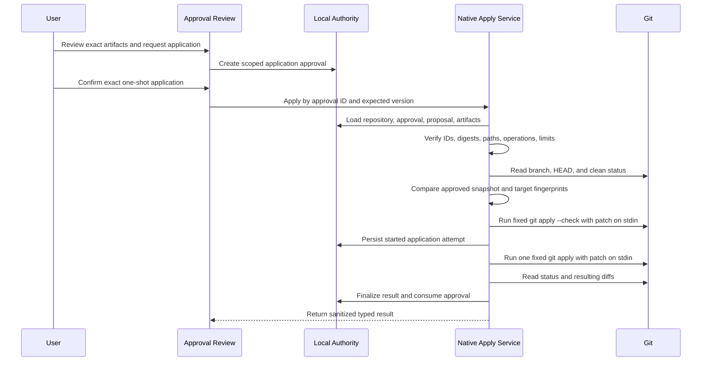

# Safe Patch Application Design

## Status

- Status: Proposed safety design
- Scope: Future application of approved generated patch artifacts
- Implementation status: Application not implemented; informational readiness
  gates implemented
- Pre-apply evidence status: Complete for the MVP Demo v1 checkpoint
- Release classification: Internal demo only; not production authorization
- Last updated: 2026-07-15

This document is a prerequisite for patch application work. It defines the
security, approval, native-command, persistence, recovery, UX, and test
contracts that must exist before the product may write a generated patch to a
repository.

Nothing in this document grants the current application permission to write
files or mutate Git state.

For the release checkpoint and recorded-demo boundary, see
[`docs/mvp-scope.md`](../mvp-scope.md) and
[`docs/release-notes/mvp-demo-v1.md`](../release-notes/mvp-demo-v1.md).

## Decision Summary

The first patch application capability must follow these decisions:

1. Existing plan or change approval is not patch-application authorization.
   Application requires a new, explicit, one-shot approval scoped to exact
   artifact digests and an exact repository snapshot.
2. React may request application by durable IDs only. It must not choose an
   arbitrary repository path, file path, Git command, argument list, or patch
   body at apply time.
3. The native application service must load authoritative repository,
   proposal, artifact, validation, and approval records before every apply.
4. The native boundary must repeat all path and structure checks and run a
   fresh `git apply --check` immediately before application.
5. Version 1 requires a clean Git working tree and a named, unchanged branch.
6. Version 1 supports only create and modify operations for regular UTF-8 text
   files. Delete, rename, binary, symlink, submodule, executable-mode, and
   metadata-only patches remain unavailable.
7. All artifacts in one approved proposal must be applied in one fixed Git
   invocation. Partial per-file application is not allowed.
8. Application changes working-tree files only. It must not stage, commit,
   reset, checkout, clean, stash, switch branches, or contact a remote.
9. Approval is consumed once. Retry requires a fresh snapshot, validation,
   dry-run, and application approval.
10. The system must persist an application attempt before the native write and
    verify repository state afterward. It must never hide an uncertain or
    partially observed outcome.

## Current Safety Boundary

The current product can:

- Persist generated patch artifacts as review-only data.
- Validate repository-relative paths and single-file unified diff structure.
- Reject unsafe, mismatched, binary, oversized, and unsupported artifacts.
- Run read-only `git apply --check --whitespace=nowarn -` inside the selected
  repository.
- Persist validation results, normalized SHA-256 artifact digests, and a
  repository snapshot containing branch, short HEAD, clean state, changed-file
  count, relevant paths, bounded target-file fingerprints, and capture time.
- Recompute artifact digests when retained patch content changes and compare
  validation evidence with a fresh read-only native snapshot digest.
- Record approval or rejection without applying a patch.
- Read real local Git status and diffs separately from generated artifacts.
- Derive informational apply-readiness gates in Agent Runs and Approval Review.
- Show a disabled `Apply unavailable` control with no application handler.

The current product cannot:

- Apply generated artifacts.
- Write repository files.
- Stage or commit changes.
- Treat `approved` or `dry_run_passed` as write permission.

These boundaries remain in force until every required gate in this document is
implemented and verified.

### Informational Readiness Gates

The current UI evaluates only data already available to the review surfaces:

- Linked approval status.
- Generated artifact state.
- Structure and dry-run validation status.
- Selected repository and proposal repository match.
- Latest known clean, dirty, or unknown working-tree state.
- Informational relative-path and protected-path checks.
- Binary and size-limit state.
- Current artifact digest compared with the digest bound to validation.
- Native validation snapshot availability.
- Target-file fingerprint availability and policy status.
- Current authoritative snapshot digest compared with the validation snapshot
  digest.

Readiness results are `closer to ready`, `blocked`, or `checks pending`. They do
not grant authority and are not consumed by a native write command. A digest
mismatch blocks readiness with a revalidation instruction. A repository
snapshot mismatch also blocks readiness. Missing native branch or HEAD data is
labeled `Requires future apply implementation`; validation that has not run is
`Not checked yet`. The native snapshot digest binds repository identity,
branch, HEAD, Git state, relevant paths, artifact digest, and sorted target-file
fingerprints. Capture timestamps are stored but intentionally excluded from the
comparison digest. All readiness checks must still be repeated by the future
native apply authority rather than trusted as frontend security decisions.

### Current Target Fingerprint Boundary

- Only safe repository-relative paths supplied by the persisted proposal are
  accepted.
- Existing regular UTF-8 files up to 256 KiB receive a SHA-256 content hash,
  byte size, and modified timestamp.
- A snapshot accepts at most 64 persisted proposal paths, each no longer than
  320 characters.
- Missing files receive a typed `missing` fingerprint without a content read.
- Binary, oversized, symlink, unreadable, forbidden, and outside-root targets
  receive typed non-hashable states.
- `.git` paths, `.env` files, private-key names/extensions, credential files,
  and secret-like files are never content-read or hashed.
- File bytes never cross the native boundary. React receives metadata and
  digests only.

## Goals

- Apply only the exact generated content that a human reviewed and authorized.
- Keep every write bounded to the selected, saved repository root.
- Prevent stale approvals from applying against changed repository state.
- Preserve pre-existing user work.
- Make the action explicit, understandable, attributable, and auditable.
- Fail closed on malformed state, runtime uncertainty, or unsupported patches.
- Leave the resulting working-tree changes unstaged and available for review.
- Provide deterministic recovery guidance without destructive automation.

## Non-Goals

Version 1 will not:

- Apply a patch from web preview.
- Accept a manually entered repository path or raw patch body.
- Apply to a dirty working tree.
- Resolve conflicts or fuzz failed hunks.
- Apply only part of an approved proposal.
- Apply binary, rename, delete, symlink, submodule, or file-mode changes.
- Stage, unstage, commit, reset, checkout, clean, stash, push, or open a pull
  request.
- Automatically roll back with Git or overwrite files after an uncertain
  failure.
- Reuse an approval indefinitely or across regenerated artifacts.
- Let a provider invoke the apply operation directly.

## Security Invariants

The implementation must preserve all of these invariants:

### Repository Boundary

- A repository must already be selected and saved through the native picker.
- The repository ID on the proposal, approval, application request, and active
  repository must match.
- Native code must resolve the repository root from authoritative saved state.
- Native code must canonicalize the repository root before validation.
- No caller-provided absolute repository path may select the write target.

### Artifact Boundary

- Every patch artifact must belong to the approved proposed change.
- Every artifact must be in `generated` state and contain retained text diff
  content.
- Every artifact digest must match the digest shown during application
  approval.
- The approved ordered artifact set must match the applied ordered artifact
  set exactly.
- Regenerating, editing, replacing, reordering, adding, or removing an artifact
  invalidates application approval.

### Approval Boundary

- Plan approval and change acceptance do not authorize application.
- Application requires an `apply_patch` approval with exact repository,
  snapshot, proposal, artifact, and operation scope.
- Approval must be pending before confirmation and consumed after one attempt.
- Replaying a consumed, expired, rejected, superseded, or stale approval must
  fail before any write.
- Providers and agent runtimes cannot approve their own output.

### Repository-State Boundary

- The repository must be Git-backed for version 1.
- The working tree and index must be clean immediately before application.
- The branch must be named and must match the approved branch.
- `HEAD`, Git status digest, and target-file fingerprints must match the
  approved snapshot.
- A fresh native structure validation and dry-run must pass after these checks.

### Command Boundary

- Native code must invoke a fixed executable and fixed arguments without a
  shell.
- Patch content may be supplied only over stdin.
- No arbitrary Git command or argument passthrough may exist.
- Application must not use `--index`, `--cached`, `--reject`, or options that
  stage changes, permit partial application, or write outside the working tree.
- Raw Git stderr and patch content must not be returned to telemetry or logs.

## Threat Model

The design must address:

- A provider returning traversal, absolute, multi-file, binary, or mismatched
  patch paths.
- A compromised or buggy frontend changing IDs, paths, patch content, or
  approval state immediately before apply.
- A stale approval being replayed after the branch, `HEAD`, files, proposal, or
  artifact content changed.
- Symlinks or nested repositories redirecting a path outside the selected
  repository.
- A dirty working tree causing generated changes to overwrite or merge with
  user-authored work.
- Multiple windows or processes attempting to apply the same approval.
- Process termination during the native write or before result persistence.
- A failed command producing unexpected partial working-tree changes.
- Sensitive patch content leaking through diagnostics, logs, analytics, or
  crash reports.
- A successful application being mistaken for staging, commit, deployment, or
  completion of the engineering task.

## Terminology

- **Plan approval**: permission to use a proposed plan as review context.
- **Change acceptance**: a human review decision on a proposed change.
- **Application approval**: one-shot permission to apply exact artifact bytes
  to an exact repository snapshot.
- **Artifact digest**: SHA-256 of the normalized retained artifact bytes plus
  the normalized file path and declared operation.
- **Repository snapshot**: the branch, `HEAD`, Git status digest, and target
  fingerprints used for validation and approval.
- **Application attempt**: durable record created before native application and
  finalized only after post-apply verification.

## Version 1 Eligibility Policy

Every condition is required. Missing or unknown values are ineligible.

| Area                 | Required state                                                                              | Failure result               |
| -------------------- | ------------------------------------------------------------------------------------------- | ---------------------------- |
| Runtime              | Native Tauri runtime                                                                        | `native_runtime_required`    |
| Repository           | Saved, selected, canonical, Git-backed root                                                 | `repository_unavailable`     |
| Repository link      | Proposal and approval repository IDs match active repository                                | `repository_mismatch`        |
| Branch               | Named branch matching approved snapshot                                                     | `branch_changed`             |
| HEAD                 | Current commit matches approved snapshot                                                    | `head_changed`               |
| Git state            | Index and working tree are clean                                                            | `working_tree_not_clean`     |
| Proposal             | `ready_for_review` or approved for application review; not rejected, superseded, or applied | `proposal_not_applicable`    |
| Artifacts            | All required artifacts are generated text with retained content                             | `artifact_unavailable`       |
| Validation           | Structure valid and fresh dry-run passes                                                    | `validation_required`        |
| Application approval | Exact, unexpired, approved, unused `apply_patch` scope                                      | `application_not_authorized` |
| Operation            | Create or modify regular UTF-8 text file                                                    | `operation_unsupported`      |
| Limits               | Existing per-artifact and future proposal aggregate limits pass                             | `patch_limit_exceeded`       |

The first implementation should use the existing 64 KiB and 4,000-line limits
for each artifact. Before implementation, an aggregate proposal file-count,
byte, and line limit must be selected, documented, and tested. Unknown or
unbounded aggregate size must fail closed.

## Unsupported Paths And File Types

Version 1 must reject:

- Absolute or empty paths.
- `.` or `..` path components.
- Null bytes, control characters, platform prefixes, or alternate separators
  that bypass normalized relative-path checks.
- `.git` and every descendant of `.git`.
- Paths traversing a symlink, nested repository, or submodule boundary.
- Targets whose nearest existing parent canonicalizes outside the repository.
- Existing symlinks, sockets, devices, FIFOs, or non-regular files.
- Environment and secret-bearing paths covered by the provider/context secret
  policy, including `.env` variants and recognized private-key files.
- Diff metadata that changes file mode, creates a symlink, changes submodule
  pointers, or encodes rename/copy behavior.

For create operations, native code must validate every existing parent path and
must reject any symlink component. It must not create missing parent
directories in version 1.

## Separate Application Approval

The current `ApprovalRequest` is not sufficient as write authorization. A
future application approval must include at least:

```ts
type PatchApplicationApproval = {
  id: string;
  action: "apply_patch";
  repositoryId: string;
  proposedChangeId: string;
  artifactDigests: Array<{
    artifactId: string;
    filePath: string;
    operation: "create" | "modify";
    sha256: string;
  }>;
  snapshot: RepositoryApplicationSnapshot;
  status:
    "pending" | "approved" | "rejected" | "consumed" | "expired" | "stale";
  createdAt: string;
  decidedAt?: string;
  expiresAt: string;
  consumedAt?: string;
};
```

Application approval must be generated only after artifacts exist and the
repository snapshot has been captured. Existing approvals must not be migrated
to approved application permissions.

Changing any scoped field creates a new approval request. The UI must never
silently broaden or refresh approval scope.

## Repository Snapshot

The approved snapshot should contain:

```ts
type RepositoryApplicationSnapshot = {
  repositoryId: string;
  canonicalRootDigest: string;
  branch: string;
  headOid: string;
  gitStatusDigest: string;
  targetFingerprints: Array<{
    path: string;
    exists: boolean;
    contentSha256?: string;
  }>;
  capturedAt: string;
};
```

The canonical root itself must remain native-only. React may receive a display
path but must not use it as authority for the application target.

For modify operations, the content digest must match immediately before apply.
For create operations, the target must still not exist. Any mismatch marks the
approval stale and requires a new review cycle.

## Native Ownership Boundary

Patch application must be owned by a dedicated native application service, not
by a generic filesystem API and not by the provider adapter.

The preferred request contract contains durable identifiers and optimistic
concurrency values only:

```ts
type ApplyApprovedPatchRequest = {
  applicationApprovalId: string;
  expectedApprovalVersion: number;
};
```

The request must not contain:

- Repository path.
- File path overrides.
- Raw patch content.
- Git executable or arguments.
- Shell command text.
- Flags that weaken validation.

The native service must load the authoritative approval, proposal, artifacts,
repository record, and latest application attempt from the local database. If
the current SQLite integration cannot provide a native authoritative read, that
boundary must be designed before application work begins. Trusting a React
payload containing approved state is not acceptable.

The future Tauri capability should expose only the dedicated command. It must
not grant broad filesystem write scope or arbitrary command execution.

## Application Sequence



The snapshot comparison and dry-run must occur in the same native request as
application. A previous `dry_run_passed` record is required review evidence but
is not sufficient by itself.

## Fixed Git Invocation

The initial implementation should use the Git executable directly through a
process API, never a shell.

Read-only gate:

```text
git apply --check --whitespace=nowarn -
```

Working-tree application:

```text
git apply --whitespace=nowarn -
```

Both invocations must:

- Run with the canonical repository root as the working directory.
- Receive the exact normalized approved artifact set over stdin.
- Use null stdout unless a bounded result is explicitly required.
- Capture stderr only for internal classification, with a strict size limit.
- Return sanitized error categories rather than raw patch or repository data.
- Have a bounded timeout and terminate the child process on timeout.

Options that permit rejected hunks, partial application, index mutation, or
arbitrary path rewriting are forbidden.

## Atomicity

All artifacts in one approved proposed change must be normalized into one
ordered patch stream and passed to one Git invocation. The implementation must
not loop over artifacts and apply them separately.

Before release, native tests must prove that a failure in any artifact leaves
all target files unchanged. The design must not assume atomic behavior without
an integration test against temporary Git repositories.

The application service must prevent concurrent attempts for the same
repository and approval. Use both:

- A durable one-at-a-time application lease or unique active-attempt
  constraint.
- An in-process repository lock for concurrent windows in the same process.

The snapshot must still be rechecked after acquiring both protections.

## Application Attempt And Audit State

Persist an immutable attempt before invoking the mutating command:

```ts
type PatchApplicationAttempt = {
  id: string;
  applicationApprovalId: string;
  repositoryId: string;
  proposedChangeId: string;
  artifactDigests: string[];
  snapshotDigest: string;
  status:
    | "prepared"
    | "applying"
    | "applied"
    | "failed_no_change"
    | "stale"
    | "outcome_unknown"
    | "partial_write_detected";
  startedAt: string;
  completedAt?: string;
  errorCode?: PatchApplicationErrorCode;
  resultingGitStatusDigest?: string;
};
```

Audit records may include IDs, digests, branch, counts, timestamps, status,
duration, and sanitized error codes. They must not include raw patch bodies,
file contents, provider credentials, raw Git stderr, or environment variables.

`PersistedProposedChange.status` may become `applied` only after post-apply
verification succeeds. Approval must become `consumed` regardless of success
once the mutating command was attempted; a retry requires a new approval.

## Post-Apply Verification

After Git exits successfully, native code must:

1. Reload Git status.
2. Verify that changed paths are exactly within the approved artifact set.
3. Verify each expected create or modify result is present.
4. Verify the index remains unchanged and no file is staged.
5. Persist the sanitized resulting status digest and applied result.
6. Mark Repository Intelligence/index facts stale rather than pretending the
   previous index describes the new working tree.
7. Return the user to read-only Changes review.

The app must not automatically stage, commit, reindex, or run project commands
after application. Those are separate actions with separate approvals.

## Failure And Recovery

### Failure Before Application

Path, digest, approval, snapshot, clean-state, validation, timeout setup, or
lease failures must produce no writes. The approval should become stale only
when its scope no longer matches; otherwise it remains pending or approved as
defined by the error category.

### Git Reports Failure

The service must reload status and target fingerprints. If they match the
pre-apply snapshot, record `failed_no_change` and consume the one-shot approval.

### Unexpected Change Or Process Interruption

If post-state cannot be proven unchanged or fully applied, record
`outcome_unknown` or `partial_write_detected` and block further application for
that repository until the user reviews Git status and diffs.

The product must not automatically run `git reset`, `git checkout`, `git clean`,
or an inverse patch. Automatic rollback can overwrite concurrent user work and
would introduce a second destructive operation.

Recovery UI should:

- State that the outcome is uncertain.
- Show read-only Git status and diffs.
- Identify expected affected paths without exposing raw secrets.
- Prevent retry until the repository returns to a known state.
- Offer documentation, not a hidden recovery command.

## UX Contract

No enabled Apply button should be added until all native and persistence gates
exist. The current review UI may show the disabled `Apply unavailable` control
only as an informational boundary; it has no click handler or write path.

The future application review surface must show:

- Repository name and display path.
- Branch and `HEAD` summary.
- Clean working-tree requirement.
- Exact file list, operations, additions, and deletions.
- Artifact validation and fresh dry-run status.
- Risk summary and validation checks.
- Clear statement that application writes working-tree files only.
- Clear statement that application does not stage, commit, push, or deploy.
- A warning that approval is one-shot and invalidated by repository changes.

Confirmation must be a distinct step after artifact review. It should require
an explicit control such as `Apply N reviewed files`, not a generic `Continue`
button. High-risk paths or future destructive operations require a stronger
confirmation than the version 1 create/modify flow.

Every disabled state must explain the failed gate, such as dirty working tree,
stale approval, unsupported operation, repository mismatch, missing artifact,
or unavailable native runtime.

## Error Contract

The native service should return typed, sanitized errors including:

```ts
type PatchApplicationErrorCode =
  | "native_runtime_required"
  | "repository_unavailable"
  | "repository_mismatch"
  | "repository_not_git"
  | "working_tree_not_clean"
  | "branch_changed"
  | "head_changed"
  | "target_changed"
  | "proposal_not_applicable"
  | "artifact_unavailable"
  | "artifact_digest_mismatch"
  | "operation_unsupported"
  | "patch_limit_exceeded"
  | "validation_required"
  | "dry_run_failed"
  | "application_not_authorized"
  | "approval_stale"
  | "approval_consumed"
  | "application_in_progress"
  | "application_failed_no_change"
  | "outcome_unknown"
  | "partial_write_detected";
```

Errors must not contain raw patch content, full file content, credentials, or
unbounded Git output.

## Required Tests Before Implementation Can Ship

### Shared Model Tests

- Application approval is separate from plan/change approval.
- Artifact digest changes invalidate approval.
- Artifact set additions, removals, and reordering invalidate approval.
- Expired, rejected, stale, and consumed approvals cannot apply.
- Unsupported operations and aggregate limits fail closed.

### Native Unit Tests

- Repository resolution uses saved IDs, not request paths.
- Traversal, absolute paths, `.git`, symlinks, submodules, and secret paths are
  rejected.
- Create targets validate their nearest existing parent.
- Dirty index, dirty working tree, untracked files, detached `HEAD`, changed
  branch, changed `HEAD`, and changed target hashes are rejected.
- Raw patch, paths, commands, and arguments cannot be overridden by the caller.
- Raw stderr and patch content are absent from serialized errors and logs.
- Approval replay and concurrent application are rejected.

### Native Integration Tests

- A valid create patch applies to a clean temporary repository.
- A valid modify patch applies to a clean temporary repository.
- The resulting files are unstaged.
- Git `HEAD`, branch, and index do not change.
- A multi-artifact failure leaves every target unchanged.
- A stale patch fails before application.
- A process timeout produces no write or an explicit uncertain outcome.
- Post-apply verification detects unexpected paths.
- No command other than the fixed read and apply commands is invoked.

### Frontend Tests

- Approval alone never triggers application.
- Apply remains absent or disabled until every eligibility gate passes.
- Confirmation shows exact files, branch, and no-stage/no-commit copy.
- Repository mismatch, dirty state, stale snapshot, unsupported operation,
  validation failure, and unavailable native runtime are explained.
- Success navigates to read-only Changes review.
- Failure and uncertain outcomes never claim that files are unchanged.
- Reload preserves the application attempt and consumed approval state.

### Packaged Desktop QA

- Verify the complete flow in a disposable repository.
- Verify no repository outside the selected root changes.
- Verify no staged changes or commits are created.
- Verify restart recovery from prepared, applying, failed, and applied attempt
  states.
- Verify logs and diagnostics contain no patch body or file content.

## Rollout Plan

1. Approve this design and resolve the blocking decisions below.
2. Add application approval, snapshot, attempt, digest, and error contracts.
3. Add native read-only eligibility evaluation and tests. Keep apply disabled.
4. Add authoritative native persistence reads and concurrency controls.
5. Add native application behind a development-only feature flag and test only
   against disposable repositories.
6. Add confirmation and result UX after native safety tests pass.
7. Perform packaged desktop security QA before enabling the capability in MVP.
8. Consider delete, rename, binary, dirty-tree, or non-Git support only through
   separate design reviews.

MVP Demo v1 completes the read-only evidence subset of step 3: structure
validation, dry-run, artifact digest, target fingerprints, snapshot digest, and
informational eligibility display. It does not complete authoritative native
record lookup, application approval, attempt persistence, locking, or any
write-capable step.

## Blocking Decisions

The following must be resolved before implementation begins:

- Exact aggregate file, byte, and line limits for one application.
- Native authoritative access to the current SQLite records.
- Cross-process repository locking strategy.
- Approval expiry duration and versioning rules.
- Supported Git versions and platform-specific process behavior.
- Crash-reconciliation rules for an attempt left in `applying` state.
- Exact secret-path deny policy and whether narrowly scoped exceptions can ever
  be approved.

## Implementation Entry Criteria

Patch application implementation may begin only when:

- This spec is reviewed and accepted.
- Blocking decisions have written outcomes.
- Application approval is explicitly separate from existing approvals.
- The native authority and persistence boundary is agreed.
- Version 1 operation and path restrictions are accepted.
- Aggregate limits are fixed.
- Test fixtures use disposable repositories only.
- The feature remains disabled in production builds until native integration
  and packaged desktop QA pass.

Until then, generated artifacts remain review-only, dry-run remains read-only,
and approval continues to produce no repository side effect.
